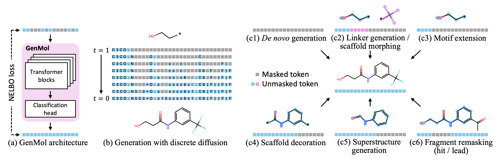

<h1 align="center">GenMol: A Drug Discovery Generalist with Discrete Diffusion</h1>

This is the official code repository for the paper titled [GenMol: A Drug Discovery Generalist with Discrete Diffusion](https://arxiv.org/abs/2501.06158) (ICML 2025).

<p align="center">
    
</p>


## Contribution
+ We introduce GenMol, a model for unified and versatile molecule generation by building masked discrete diffusion that generates SAFE molecular sequences.
+ We propose fragment remasking, an effective strategy for exploring chemical space using molecular fragments as the unit of exploration.
+ We propose molecular context guidance (MCG), a guidance scheme for GenMol to effectively utilize molecular context information.
+ We validate the efficacy and versatility of GenMol on a wide range of drug discovery tasks.

## 🚀 News

#### 2025/10/15
We introduce GenMol V2, trained with an extended SAFE syntax, demonstrating improved performance in *de novo* and fragment-constrained generation. Please refer to the section below: [GenMol V2: GenMol with Extended SAFE Syntax](#-genmol-v2-genmol-with-extended-safe-syntax).

## Table of Contents
- [Installation](#installation)
- [GenMol V1](#genmol-v1)
  - [Training](#training)
  - [Training with User-defined Dataset](#optional-training-with-user-defined-dataset)
  - [*De Novo* Generation](#de-novo-generation)
  - [Fragment-constrained Generation](#fragment-constrained-generation)
  - [Goal-directed Hit Generation (PMO Benchmark)](#goal-directed-hit-generation-pmo-benchmark)
  - [Goal-directed Lead Optimization](#goal-directed-lead-optimization)
- [GenMol V2: GenMol with Extended SAFE Syntax](#-genmol-v2-genmol-with-extended-safe-syntax)
  - [Summary](#summary)
  - [Introduction](#introduction)
  - [Benchmarks](#benchmarks)
  - [Training](#training-1)
  - [*De Novo* Generation](#de-novo-generation-1)
  - [Fragment-constrained Generation](#fragment-constrained-generation-1)
- [License](#license)
- [Citation](#citation)

## 📦 Installation
Clone this repository:
```bash
git clone https://github.com/NVIDIA-Digital-Bio/genmol.git
cd genmol
```

Run the following command to install the dependencies:
```bash
bash env/setup.sh
```

<details>
<summary>Troubleshooting: ImportError: libXrender.so.1</summary>

Run the following command:
```bash
apt update && apt install -y libsm6 libxext6 && apt-get install -y libxrender-dev
```
</details>

<details>
<summary>Troubleshooting: ImportError: cannot import name '_CONFIG_FOR_DOC' from 'transformers.models.gpt2.modeling_gpt2'</summary>

Run the following command:
```bash
#!/bin/bash

# Use CONDA_PREFIX which points to current active environment
if [ -z "$CONDA_PREFIX" ]; then
    echo "Error: No conda environment is currently active"
    exit 1
fi

# Comment out all lines in the safe package __init__.py
sed -i 's/^/# /' "$CONDA_PREFIX/lib/python3.10/site-packages/safe/__init__.py"

# Import required packages
echo "from .converter import SAFEConverter, decode, encode" >> "$CONDA_PREFIX/lib/python3.10/site-packages/safe/__init__.py"

echo "Fixed safe package in environment: $CONDA_PREFIX"
```
</details>

## 🔬 GenMol V1
### Training
We provide the pretrained [checkpoint](https://catalog.ngc.nvidia.com/orgs/nvidia/teams/clara/resources/genmol_v1). Place `model.ckpt` in the current top genmol directory.

(Optional) To train GenMol from scratch, run the following command:
```bash
torchrun --nproc_per_node ${num_gpu} scripts/train.py hydra.run.dir=${save_dir} wandb.name=${exp_name}
```
Other hyperparameters can be adjusted in `configs/base.yaml`.<br>
The training used 8 NVIDIA A100 GPUs and took ~5 hours.

### (Optional) Training with User-defined Dataset
We used the [SAFE dataset](https://huggingface.co/datasets/datamol-io/safe-gpt) to train GenMol. To use your own training dataset, first convert your SMILES dataset into SAFE by running the following command:
```bash
python scripts/preprocess_data.py ${input_path} ${data_path}
```
`${input_path}` is the path to the dataset file with a SMILES in each row. For example,
```
CCS(=O)(=O)N1CC(CC#N)(n2cc(-c3ncnc4[nH]ccc34)cn2)C1
NS(=O)(=O)c1cc2c(cc1Cl)NC(C1CC3C=CC1C3)NS2(=O)=O
...
```
`${data_path}` is the path of the processed dataset.

Then, set `data` in `base.yaml` to `${data_path}`.

### *De Novo* Generation
Run the following command to perform *de novo* generation:
```bash
python scripts/exps/denovo/run.py
```

<details>
<summary>Troubleshooting: _pickle.UnpicklingError: invalid load key, '<'</summary>

If you see this error, it is likely coming from `/miniconda3/envs/genmol/lib/python3.10/site-packages/tdc/chem_utils/oracle/oracle.py`, line 347, in readFragmentScores `_fscores = pickle.load(f)`

The root cause is a corrupted or incompletely downloaded pkl file for the SA score. The fix is simple: grab the correct files from the official RDKit repository:
https://github.com/rdkit/rdkit/tree/master/Contrib/SA_Score/fpscores.pkl.gz

Extract the downloaded file into the `genmol/oracle` directory.
</details>

The experiment in the paper used 1 NVIDIA A100 GPU.

### Fragment-constrained Generation
Run the following command to perform fragment-constrained generation:
```bash
python scripts/exps/frag/run.py
```

The experiment in the paper used 1 NVIDIA A100 GPU.

### Goal-directed Hit Generation (PMO Benchmark)

We provide the fragment vocabularies in the folder `scripts/exps/pmo/vocab`.

(Optional) Place [zinc250k.csv](https://www.kaggle.com/datasets/basu369victor/zinc250k) in the `data` folder, then run the following command to construct the fragment vocabularies and label the molecules with property labels:
```bash
python scripts/exps/pmo/get_vocab.py
```

Run the following command to perform goal-directed hit generation:
```bash
python scripts/exps/pmo/run.py -o ${oracle_name}
```
The generated molecules will be saved in `scripts/exps/pmo/main/genmol/results`.

Run the following command to evaluate the result:
```bash
python scripts/exps/pmo/eval.py ${file_name}
# e.g., python scripts/exps/pmo/eval.py scripts/exps/pmo/main/genmol/results/albuterol_similarity_0.csv
```

The experiment in the paper used 1 NVIDIA A100 GPU and took ~2-4 hours for each task.

### Goal-directed Lead Optimization
Run the following command to perform goal-directed lead optimization:
```bash
python scripts/exps/lead/run.py -o ${oracle_name} -i ${start_mol_idx} -d ${sim_threshold}
```
The generated molecules will be saved in `scripts/exps/lead/results`.

Run the following command to evaluate the result:
```bash
python scripts/exps/lead/eval.py ${file_name}
# e.g., python scripts/exps/lead/eval.py scripts/exps/lead/results/parp1_id0_thr0.4_0.csv
```

The experiment in the paper used 1 NVIDIA A100 GPU and took ~10 min for each task.

## 🚀 GenMol V2: GenMol with Extended SAFE Syntax (Angle-Brackets for Inter-Fragment Attachment Points)
### Summary: 
GenMol V2 introduces Extended SAFE Syntax, which uses *angle-brackets* for Inter-Fragment Attachment Points. This change improves performance for specific tasks, particularly one-step linker design.

### Introduction:
Following SAFE-GPT, GenMol performs two-step linker design in fragment-constrained generation, i.e., two molecules are respectively generated given each of two fragments and then combined later as a single molecule. However, users may prefer one-step generation that can condition the context of both fragments at the same time.

While GenMol shows versatile performance on various tasks, it shows low validity in some tasks, especially in one-step linker design. We attribute this to the standard SAFE syntax, which considers the `intra-fragment` (linked atoms are in the same fragment) and `inter-fragment` (links between two fragments) attachment points are not easy to distinguish. 

To this end, we propose an extended SAFE syntax that uses angle-brackets to distinguish intra-fragment attachment points from inter-fragment attachment points.

For example, a SAFE string
```
X1XXX1X2.X2X3XXXX3X4.X5XX5X4
```
has 1, 3, 5 as its intra-fragment attachment points, while 2 and 4 are inter-fragment attachment points. With the extended syntax it becomes:
```
X1XXX1X<1>.X<1>X1XXXX1X<2>.X1XX1X<2>
```
In this way, the links within a fragment (i.e., 1, 2, ...) are independent to links crossing fragments (i.e., <1>, <2>, ...) and the model can learn how to complete a SAFE more efficiently.

GenMol V2 trained with the extended SAFE syntax actually shows significantly improved performance on *de novo* and fragment-constrained generation! On goal-directed hit generation and lead optimization, GenMol V2 performs slightly worse than GenMol. This is because GenMol performs fragment remasking in these tasks, which changes only a small part of the entire molecular sequence, and therefore does not benefit from the extended SAFE syntax.

### Benchmarks

<h4 align="center">Table. De Novo Generation</h4>

| Model | Validity (%) | Uniqueness (%) | Quality (%) | Diversity |
| --- | --- | --- | --- | --- |
| GenMol | 100.0 | 99.7 | 84.6 | 0.818 |
| GenMol V2 | 100.0 | 97.8 | 89.7 | 0.830 |

<h4 align="center">Table. Fragment-constrained Generation</h4>

| Model | Task | Validity (%) | Uniqueness (%) | Quality (%) | Diversity | Distance |
| --- | --- | --- | --- | --- | --- | --- |
| GenMol | Linker design (1-step) | 16.7 | 93.9 | 4.3 | 0.529 | 0.573 |
| | Linker design | 100.0 | 83.7 | 21.9 | 0.547 | 0.563 |
| | Motif extension | 82.9 | 77.5 | 30.1 | 0.617 | 0.682 |
| | Scaffold decoration | 96.6 | 82.7 | 31.8 | 0.591 | 0.651 |
| | Superstructure generation | 97.5 | 83.6 | 34.8 | 0.599 | 0.762 |
| GenMol V2 | Linker design (1-step) | 81.8 | 87.1 | 28.6 | 0.566 | 0.545 |
| | Linker design | 100.0 | 76.6 | 18.4 | 0.512 | 0.539 |
| | Motif extension | 99.4 | 84.5 | 49.0 | 0.626 | 0.659 |
| | Scaffold decoration | 99.2 | 90.5 | 39.7 | 0.571 | 0.604 |
| | Superstructure generation | 99.7 | 89.8 | 39.0 | 0.551 | 0.769 |

<h4 align="center">Table. Goal-directed Hit Generation</h4>

| Model | PMO Sum Score |
| --- | --- |
| GenMol | 18.362 |
| GenMol V2 | 17.943 |

<h4 align="center">Table. Goal-directed Lead Optimization</h4>

| Model | Success rate (%) |
| --- | --- |
| GenMol | 86.7 |
| GenMol V2 | 80.0 |

### Training
We provide the trained GenMol V2 [checkpoint](https://catalog.ngc.nvidia.com/orgs/nvidia/teams/clara/resources/genmol_v2?version=1.0). Place `model_v2.ckpt` in the current top genmol directory.

(Optional) To train GenMol V2 from scratch, run the following command:
```bash
torchrun --nproc_per_node ${num_gpu} scripts/train.py hydra.run.dir=${save_dir} wandb.name=${exp_name} loader.global_batch_size=1024 training.use_bracket_safe=true
```
The training used 8 NVIDIA A100 GPUs.

### *De Novo* Generation
Run the following command to perform *de novo* generation using GenMol V2:
```bash
python scripts/exps/denovo/run.py -c hparams_v2.yaml
```

### Fragment-constrained Generation
Run the following command to perform fragment-constrained generation using GenMol V2:
```bash
python scripts/exps/frag/run.py -c hparams_v2.yaml
```

## License
Copyright @ 2025, NVIDIA Corporation. All rights reserved.<br>
The source code is made available under Apache-2.0.<br>
The model weights are made available under the [NVIDIA Open Model License](https://www.nvidia.com/en-us/agreements/enterprise-software/nvidia-open-model-license/).

## 📝 Citation
If you find this repository and our paper useful, we kindly request to cite our work.
```BibTex
@article{lee2025genmol,
  title     = {GenMol: A Drug Discovery Generalist with Discrete Diffusion},
  author    = {Lee, Seul and Kreis, Karsten and Veccham, Srimukh Prasad and Liu, Meng and Reidenbach, Danny and Peng, Yuxing and Paliwal, Saee and Nie, Weili and Vahdat, Arash},
  journal   = {International Conference on Machine Learning},
  year      = {2025}
}
```
